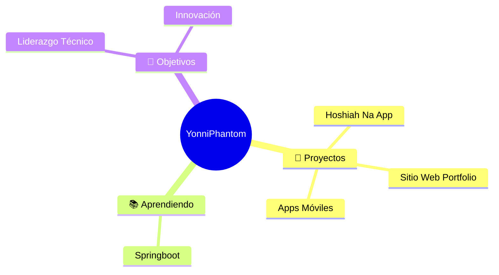

<div align="center">

# 👻 YonniPhantom


### 💫 Apasionado por la programación, especializado en desarrollo web y móvil
### 🎯 Transformando ideas en experiencias digitales


</div>

---

## 🚀 Sobre Mí


```javascript
const yonniPhantom = {
    nombre: "YonniPhantom",
    rol: "Desarrollador Full Stack | Web | Móvil",
    experiencia: "2+ años",
    aprendiendo: ["Springboot"],
    tecnologias: {
        frontend: ["React", "Next.js", "TypeScript", "Tailwind CSS"],
        backend: ["Node.js", "Express", "Firebase"],
        movil: ["React Native", "iOS", "Android"],
        herramientas: ["Postman", "Git", "Figma", "VS Code"]
    },
    datosCuriosos: "Amo la pizza 🍕 y programar a las 3 AM ☕"
};
```

- 🔭 Actualmente trabajando en **Hoshiah Na App** - App de boletaje digital
- 🌱 Aprendiendo **Springbootn**
- 👨‍💻 Portafolio: **[yonniphantom.dev](https://yonniphantom.dev)**
- 📫 Contacto: **jonathan.herrerarob@gmail.com**
- ⚡ Dato curioso: **¡La pizza alimenta mi mejor código! 🍕🤤**

---

## 🌐 Conéctate Conmigo

<div align="center">

[](https://yonniphantom.dev)
[](mailto:jonathan.herrerarob@gmail.com)
[](https://linkedin.com/in/yonniphantom)

</div>

---

## 🛠️ Stack Tecnológico

<div align="center">

### 🎨 Frontend


### ⚙️ Backend


### 📱 Móvil


### 🗄️ Bases de Datos


### 🛠️ Herramientas y Tecnologías


</div>

---

## 🎯 Enfoque Actual

<div align="center">


```mermaid
mindmap
  root((YonniPhantom))
    🚀 Proyectos
      Hoshiah Na App
      Sitio Web Portfolio
      Apps Móviles
    📚 Aprendiendo
      Springboot
    🎯 Objetivos
      Liderazgo Técnico
      Innovación
```

</div>

---

## ☕ Apoya Mi Trabajo

<div align="center">

Si te gusta mi trabajo y quieres apoyarme, ¡considera invitarme un café! ☕

[](https://www.buymeacoffee.com/yonniphantom)

</div>

---

<div align="center">

### 🌟 "El código es como el humor. Cuando tienes que explicarlo, es malo." - Cory House


**¡Gracias por visitar! ¡Conectemos y construyamos algo increíble juntos! 🚀**

</div>
